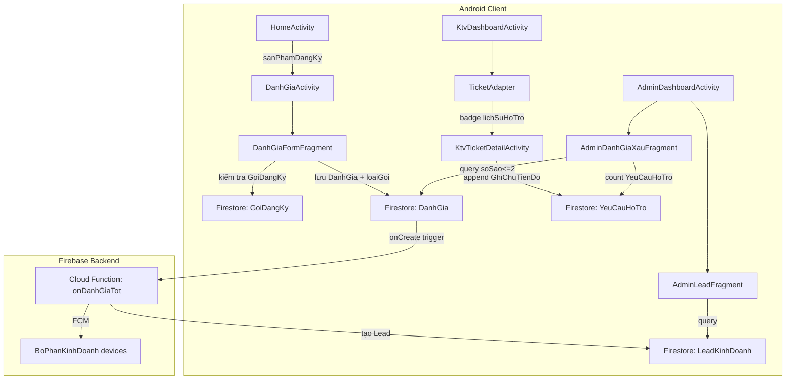
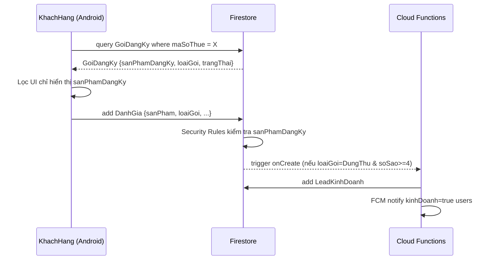

# Design Document: Enterprise Customer Care Improvements

## Overview

Feature này mở rộng hệ thống CSKH B2B (Android Java + Firebase Firestore) theo bốn hướng:

1. **Thống kê đánh giá xấu** – Admin xem danh sách `DanhGia` có `soSao <= 2` kèm số lần hỗ trợ liên quan trong 30 ngày.
2. **Kiểm soát quyền đánh giá** – Chỉ cho phép đánh giá sản phẩm có trong `GoiDangKy.sanPhamDangKy` đang hoạt động.
3. **Gói dùng thử + Lead kinh doanh** – Hỗ trợ `loaiGoi = "DungThu"`, tự động tạo Lead khi đánh giá tốt (soSao >= 4).
4. **KTV Handoff** – KTV ghi chú tiến độ vào `lichSuHoTro` của `YeuCauHoTro` để KTV kế tiếp tiếp tục đúng bước.

Hệ thống hiện tại đã có: Android Java (minSdk 24), Firebase Auth, Firestore, Cloud Functions (Node.js), FCM. Không thay đổi kiến trúc tổng thể, chỉ mở rộng model, UI và Cloud Functions.

---

## Architecture



**Luồng kiểm soát quyền đánh giá:**



---

## Components and Interfaces

### 1. Model Layer (thêm/sửa)

| Class | Thay đổi |
|---|---|
| `GoiDangKy` | Thêm field `loaiGoi: String` ("ChinhThuc" \| "DungThu") |
| `DanhGia` | Thêm fields: `loaiGoi: String`, `maSoThue: String`, `tenCongTy: String` |
| `YeuCauHoTro` | Thêm field `lichSuHoTro: List<Map<String, Object>>` |
| `LeadKinhDoanh` | Model mới (xem Data Models) |
| `GhiChuTienDo` | Model mới – helper POJO cho phần tử trong `lichSuHoTro` |

### 2. UI Layer (thêm/sửa)

| Component | Thay đổi |
|---|---|
| `DanhGiaActivity` | Truyền `loaiGoi` từ `GoiDangKy` xuống fragment |
| `DanhGiaFormFragment` | Truy vấn `GoiDangKy` trước khi render; gắn `loaiGoi`, `maSoThue`, `tenCongTy` vào `DanhGia` khi lưu |
| `KtvTicketDetailActivity` | Thêm section ghi chú tiến độ: `RecyclerView` lịch sử + `EditText` + nút "Lưu ghi chú" |
| `TicketAdapter` | Hiển thị badge "Có ghi chú từ KTV trước" nếu `lichSuHoTro` không rỗng |
| `AdminDashboardActivity` | Thêm 2 tab mới: "Đánh giá xấu" (index 5) và "Lead" (index 6) |
| `AdminDanhGiaXauFragment` | Fragment mới – danh sách DanhGia_Xau + count ticket liên quan |
| `DanhGiaXauAdapter` | Adapter mới cho danh sách đánh giá xấu |
| `AdminLeadFragment` | Fragment mới – danh sách LeadKinhDoanh + cập nhật trạng thái |
| `LeadAdapter` | Adapter mới cho danh sách lead |

### 3. Backend (Cloud Functions)

| Function | Mô tả |
|---|---|
| `onDanhGiaTot` | Trigger `DanhGia.onCreate`: nếu `loaiGoi = "DungThu"` và `soSao >= 4`, tạo `LeadKinhDoanh` và gửi FCM |

### 4. Firestore Security Rules (bổ sung)

```
// Collection DanhGia – chỉ cho phép lưu nếu sanPham nằm trong GoiDangKy đang hoạt động
match /DanhGia/{id} {
  allow create: if request.auth != null
    && sanPhamTrongGoi(request.auth.uid, request.resource.data.sanPham);
}

// Collection LeadKinhDoanh – chỉ Admin/KTV kinhDoanh mới đọc/ghi
match /LeadKinhDoanh/{id} {
  allow read, write: if isAdminOrKinhDoanh();
}
```

*(Hàm helper `sanPhamTrongGoi` truy vấn `GoiDangKy` theo `maSoThue` của user)*

---

## Data Models

### GoiDangKy (sửa đổi)

```java
public class GoiDangKy {
    // ... fields hiện có ...
    private String loaiGoi;  // "ChinhThuc" | "DungThu"  [MỚI]

    public static final String LOAI_GOI_CHINH_THUC = "ChinhThuc";
    public static final String LOAI_GOI_DUNG_THU   = "DungThu";
}
```

Firestore document (collection `GoiDangKy`, doc id = `maSoThue`):
```json
{
  "maSoThue": "0123456789",
  "tenCongTy": "Công ty ABC",
  "sanPhamDangKy": ["ECUS5", "E-INVOICE"],
  "loaiGoi": "DungThu",
  "trangThai": "HoatDong",
  "ngayDangKy": "<Timestamp>",
  "ngayHetHan": "<Timestamp>"
}
```

### DanhGia (sửa đổi)

```java
public class DanhGia {
    // ... fields hiện có ...
    private String loaiGoi;    // "ChinhThuc" | "DungThu" | null  [MỚI]
    private String maSoThue;   // MST công ty của người đánh giá   [MỚI]
    private String tenCongTy;  // Tên công ty                      [MỚI]
}
```

### YeuCauHoTro (sửa đổi)

```java
public class YeuCauHoTro {
    // ... fields hiện có ...
    private List<Map<String, Object>> lichSuHoTro;  // [MỚI]
    // Mỗi phần tử: {ktvUid, ktvTen, noiDung, thoiDiem}
}
```

### GhiChuTienDo (model mới – POJO helper)

```java
// model/GhiChuTienDo.java
public class GhiChuTienDo {
    private String ktvUid;
    private String ktvTen;
    private String noiDung;       // tối đa 1000 ký tự
    private Timestamp thoiDiem;
}
```

### LeadKinhDoanh (model mới)

```java
// model/LeadKinhDoanh.java
public class LeadKinhDoanh {
    private String id;
    private String maSoThue;
    private String tenCongTy;
    private String sanPham;
    private int soSao;
    private String noiDung;
    private String trangThaiLead;  // "Moi" | "DangTuVan" | "DaDangKy" | "TuChoi"
    private Timestamp taoLuc;
    private Timestamp capNhatLuc;
}
```

Firestore document (collection `LeadKinhDoanh`):
```json
{
  "maSoThue": "0123456789",
  "tenCongTy": "Công ty ABC",
  "sanPham": "ECUS5",
  "soSao": 5,
  "noiDung": "Sản phẩm rất tốt, muốn đăng ký chính thức",
  "trangThaiLead": "Moi",
  "taoLuc": "<Timestamp>",
  "capNhatLuc": "<Timestamp>"
}
```

---

## Correctness Properties

*A property is a characteristic or behavior that should hold true across all valid executions of a system — essentially, a formal statement about what the system should do. Properties serve as the bridge between human-readable specifications and machine-verifiable correctness guarantees.*

### Property 1: Danh sách đánh giá xấu chỉ chứa soSao <= 2

*For any* tập hợp DanhGia được trả về bởi màn hình thống kê đánh giá xấu, tất cả các phần tử đều phải có `soSao <= 2`.

**Validates: Requirements 1.1**

---

### Property 2: Số lần hỗ trợ liên quan được đếm đúng trong 30 ngày

*For any* DanhGia_Xau với `uid` và `taoLuc` xác định, số YeuCauHoTro được hiển thị cạnh mục đó phải bằng đúng số document trong collection `YeuCauHoTro` có cùng `uid` và `taoLuc` nằm trong khoảng `[taoLuc - 30 ngày, taoLuc]`.

**Validates: Requirements 1.3**

---

### Property 3: Chỉ sản phẩm trong GoiDangKy mới được đánh giá

*For any* KhachHang với `maSoThue` xác định và `GoiDangKy` đang hoạt động, mọi `DanhGia` được lưu thành công phải có `sanPham` nằm trong `GoiDangKy.sanPhamDangKy` của gói đó.

**Validates: Requirements 2.1, 2.3, 2.4**

---

### Property 4: Không có gói hoạt động thì không đánh giá được

*For any* KhachHang không có `GoiDangKy` nào với `trangThai = "HoatDong"`, mọi thao tác gửi DanhGia đều phải bị từ chối (cả client lẫn Firestore Security Rules).

**Validates: Requirements 2.2, 2.4**

---

### Property 5: Lead chỉ được tạo khi đủ điều kiện DungThu + soSao >= 4

*For any* DanhGia được lưu, một document `LeadKinhDoanh` được tạo khi và chỉ khi `loaiGoi = "DungThu"` VÀ `soSao >= 4`. Với mọi DanhGia không thỏa điều kiện này, không có Lead nào được tạo.

**Validates: Requirements 3.3, 3.7**

---

### Property 6: Lead mới chứa đầy đủ thông tin bắt buộc

*For any* Lead được tạo tự động từ DanhGia, document `LeadKinhDoanh` phải chứa đầy đủ: `maSoThue`, `tenCongTy`, `sanPham`, `soSao`, `noiDung`, `taoLuc`, và `trangThaiLead = "Moi"`.

**Validates: Requirements 3.3**

---

### Property 7: GhiChuTienDo rỗng/khoảng trắng bị từ chối

*For any* chuỗi `noiDung` chỉ gồm khoảng trắng (bao gồm chuỗi rỗng), thao tác lưu GhiChuTienDo phải bị từ chối và `lichSuHoTro` không thay đổi.

**Validates: Requirements 4.4**

---

### Property 8: GhiChuTienDo vượt 1000 ký tự bị từ chối

*For any* chuỗi `noiDung` có độ dài > 1000 ký tự, thao tác lưu GhiChuTienDo phải bị từ chối và `lichSuHoTro` không thay đổi.

**Validates: Requirements 4.8**

---

### Property 9: lichSuHoTro được append đúng thứ tự thời gian

*For any* YeuCauHoTro, sau khi KTV lưu một GhiChuTienDo mới, phần tử đó phải xuất hiện ở cuối `lichSuHoTro` với `thoiDiem >= thoiDiem` của tất cả phần tử trước đó.

**Validates: Requirements 4.3, 4.5**

---

### Property 10: Badge "Có ghi chú từ KTV trước" hiển thị đúng

*For any* YeuCauHoTro, badge "Có ghi chú từ KTV trước" xuất hiện trên card ticket khi và chỉ khi `lichSuHoTro` không rỗng.

**Validates: Requirements 4.6**

---

## Error Handling

| Tình huống | Xử lý |
|---|---|
| `GoiDangKy` không tồn tại hoặc hết hạn | Hiển thị thông báo "Doanh nghiệp của bạn chưa có gói đăng ký đang hoạt động", ẩn danh sách sản phẩm |
| Gửi DanhGia cho sản phẩm không trong gói | Client từ chối trước khi gọi Firestore; Security Rules từ chối nếu bypass |
| Cloud Function tạo Lead thất bại | Retry tự động (Firebase Functions retry policy); DanhGia vẫn được lưu bình thường |
| FCM gửi thông báo thất bại | Log lỗi, không ảnh hưởng luồng chính; Lead vẫn được tạo |
| Ghi chú rỗng hoặc > 1000 ký tự | Validate phía client, hiển thị thông báo lỗi tương ứng, không gọi Firestore |
| Firestore offline khi lưu GhiChuTienDo | Firestore SDK tự cache và sync khi online; hiển thị trạng thái "Đang lưu..." |
| `lichSuHoTro` null khi đọc từ Firestore | Khởi tạo list rỗng trong getter, tránh NullPointerException |

---

## Testing Strategy

### Unit Tests

Tập trung vào các trường hợp cụ thể và edge case:

- `GoiDangKy` với `loaiGoi = null` (document cũ chưa migrate) → không crash
- `DanhGiaFormFragment`: khi `GoiDangKy` trả về list rỗng → ẩn toàn bộ UI đánh giá
- `GhiChuTienDo` validation: chuỗi rỗng, chuỗi toàn khoảng trắng, chuỗi đúng 1000 ký tự, chuỗi 1001 ký tự
- `AdminDanhGiaXauFragment`: khi không có DanhGia_Xau → hiển thị empty state
- `LeadKinhDoanh` serialization/deserialization với Firestore

### Property-Based Tests

Sử dụng thư viện **[junit-quickcheck](https://github.com/pholser/junit-quickcheck)** (Java, tích hợp JUnit 4/5).

Mỗi property test chạy tối thiểu **100 iterations**.

Mỗi test được tag theo format: `// Feature: enterprise-customer-care-improvements, Property N: <mô tả>`

**Property 1 – Danh sách đánh giá xấu chỉ chứa soSao <= 2**
```java
// Feature: enterprise-customer-care-improvements, Property 1: DanhGia_Xau filter
@Property(trials = 100)
public void danhGiaXauChiChuaSoSaoNhoHon3(@InRange(min=1, max=5) int soSao, ...) {
    // Generate DanhGia với soSao ngẫu nhiên, lưu vào mock Firestore
    // Query với filter soSao <= 2
    // Assert: tất cả kết quả có soSao <= 2
}
```

**Property 3 – Chỉ sản phẩm trong GoiDangKy mới được đánh giá**
```java
// Feature: enterprise-customer-care-improvements, Property 3: sanPham permission check
@Property(trials = 100)
public void chiSanPhamTrongGoiMoiDuocDanhGia(List<String> sanPhamDangKy, String sanPhamDanhGia) {
    // Generate GoiDangKy với sanPhamDangKy ngẫu nhiên
    // Thử lưu DanhGia với sanPhamDanhGia ngẫu nhiên
    // Assert: lưu thành công ⟺ sanPhamDanhGia ∈ sanPhamDangKy
}
```

**Property 5 – Lead chỉ tạo khi DungThu + soSao >= 4**
```java
// Feature: enterprise-customer-care-improvements, Property 5: Lead creation condition
@Property(trials = 100)
public void leadChiTaoKhiDungThuVaSoSaoCao(String loaiGoi, @InRange(min=1, max=5) int soSao) {
    // Simulate Cloud Function logic với loaiGoi và soSao ngẫu nhiên
    // Assert: Lead được tạo ⟺ "DungThu".equals(loaiGoi) && soSao >= 4
}
```

**Properties 7 & 8 – GhiChuTienDo validation (kết hợp)**
```java
// Feature: enterprise-customer-care-improvements, Property 7+8: GhiChuTienDo validation
@Property(trials = 100)
public void ghiChuTienDoValidation(String noiDung) {
    // Generate noiDung ngẫu nhiên (bao gồm whitespace-only và chuỗi dài)
    boolean valid = noiDung != null && !noiDung.trim().isEmpty() && noiDung.length() <= 1000;
    // Assert: lưu thành công ⟺ valid
}
```

**Property 9 – lichSuHoTro append đúng thứ tự**
```java
// Feature: enterprise-customer-care-improvements, Property 9: lichSuHoTro ordering
@Property(trials = 100)
public void lichSuHoTroThuTuTangDan(List<GhiChuTienDo> ghiChuList) {
    // Append nhiều GhiChuTienDo theo thứ tự ngẫu nhiên
    // Assert: thoiDiem[i] <= thoiDiem[i+1] với mọi i
}
```

**Property 10 – Badge hiển thị đúng**
```java
// Feature: enterprise-customer-care-improvements, Property 10: badge visibility
@Property(trials = 100)
public void badgeHienThiDungKhiCoGhiChu(List<GhiChuTienDo> lichSuHoTro) {
    // Generate YeuCauHoTro với lichSuHoTro ngẫu nhiên (có thể rỗng)
    boolean coGhiChu = lichSuHoTro != null && !lichSuHoTro.isEmpty();
    // Assert: badge visible ⟺ coGhiChu
}
```
